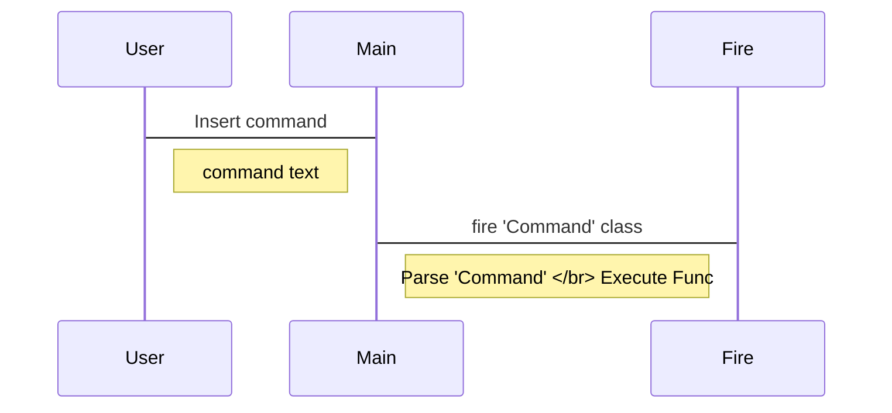
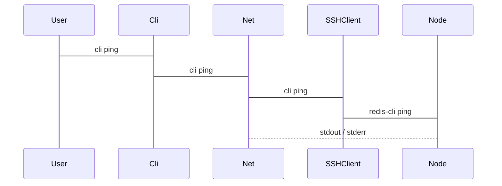

# Code review

## 1. Skill set

- fire
- prompt-toolkit
- click
- redis-py-cluster
- hiredis

cli/requirements.txt에서 더 자세한 정보를 확인할 수 있습니다.

## 2. Skeleton

```
./cli/
.
├── LICENSE
├── README.md
├── docs # documents
├── fbcli # source code
├── install.sh # install script
├── pip_modules # collection of pip modules for offline install
├── requirements.txt # pip requirements
├── setup.py # setup filei for install fbcli
└── sql # sample sql scripts
```

## 3. Seq diagram

### Basic flow



### Cli ping flow


